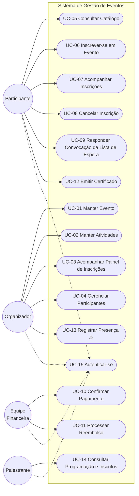

# Casos de Uso — Sistema de Gestão de Eventos

**Documentos relacionados:** [requisitos-funcionais.md](../analise/requisitos-funcionais.md) · [regras-de-negocio.md](../analise/regras-de-negocio.md) · [glossario.md](glossario.md) · [diagrama-estados-inscricao.md](diagrama-estados-inscricao.md) · [tabelas-de-decisao.md](tabelas-de-decisao.md) · [duvidas-e-lacunas.md](../analise/duvidas-e-lacunas.md)
**Versão:** 1.0
**Status:** Proposta para validação com stakeholders

## Objetivo e abordagem

Especificar as interações entre os atores e o sistema. Os casos de uso **críticos** (inscrição, cancelamento, pagamento, lista de espera, certificado) estão em formato completo — fluxo principal, alternativos e de exceção; os demais, em formato resumido. Passos que dependem de questões em aberto estão marcados com ⚠️ Q-XX; nesses pontos o fluxo descreve a **premissa adotada** (mesma dos artefatos anteriores), a revisar após as reuniões.

## Diagrama de visão geral

**Relações de inclusão/extensão relevantes:** UC-06 *include* UC-05 (escolha do evento) · UC-06 *extend* UC-09 (evento lotado) · UC-08 *extend* UC-11 (cancelamento com direito a reembolso) · UC-10 conclui inscrições iniciadas em UC-06.

---

## Casos de uso críticos (formato completo)

### UC-06 — Inscrever-se em Evento

| | |
| --- | --- |
| **Ator principal** | Participante |
| **Atores secundários** | Equipe Financeira (via UC-10, eventos pagos) |
| **Requisitos** | RF-04, RF-09, RF-10, RF-11 |
| **Regras** | RN-01, RN-02, RN-04, RN-08, RN-09, RN-10, RN-11 · TD-01 |
| **Pré-condições** | Participante autenticado (UC-15); evento publicado e com inscrições abertas |
| **Pós-condição de sucesso** | Inscrição em estado `Confirmada` (gratuito) ou `Aguardando Pagamento` (pago); comprovante enviado quando efetivada |

**Fluxo principal (evento gratuito):**
1. O Participante seleciona um evento no catálogo (inclui UC-05).
2. O sistema exibe os detalhes do evento, a política de cancelamento/reembolso e as atividades disponíveis.
3. O Participante seleciona as atividades desejadas, se houver (RF-10).
4. O sistema verifica a disponibilidade de vagas no evento e nas atividades selecionadas (RN-01).
5. O sistema verifica conflitos de horário entre as atividades selecionadas. ⚠️ Q-07 — *premissa: alerta o Participante, sem bloquear.*
6. O sistema registra a inscrição, decrementa as vagas e a coloca no estado `Confirmada` (RN-09).
7. O sistema envia o comprovante de inscrição (RN-08) e exibe a confirmação. **Fim.**

**Fluxo alternativo A1 — Evento pago (a partir do passo 6):**
1. O sistema registra a inscrição no estado `Aguardando Pagamento` (RN-10) e reserva a vaga. ⚠️ Q-01 — *premissa: reserva com prazo de expiração.*
2. O sistema apresenta as instruções de pagamento. ⚠️ Q-10 — *meio de pagamento a definir.*
3. O Participante efetua o pagamento; a confirmação ocorre em UC-10.
4. Confirmado o pagamento, o sistema efetiva a inscrição (`Confirmada`) e envia o comprovante. **Fim.**

**Fluxo alternativo A2 — Evento lotado (a partir do passo 4):**
1. O sistema informa a lotação e oferece a lista de espera (RN-02). ⚠️ Q-04.
2. Se o Participante aceitar, o sistema o inclui na lista (`Em Lista de Espera`) e informa sua posição. **Fim** (continua em UC-09 quando surgir vaga).
3. Se recusar, o sistema encerra sem registrar inscrição. **Fim.**

**Fluxos de exceção:**
- **E1 — Vaga esgota durante o processo:** entre os passos 4 e 6, se a última vaga for tomada por inscrição concorrente, o sistema informa e oferece A2 (RNF-10 — em nenhuma hipótese confirma acima do limite).
- **E2 — Pagamento não confirmado no prazo:** ⚠️ Q-01 — *premissa:* o sistema expira a inscrição (`Expirada`), libera a vaga (RN-07), aciona a lista de espera e notifica o Participante.
- **E3 — Atividade selecionada lotada:** o sistema informa quais atividades estão sem vaga e permite refazer a seleção ou entrar na lista de espera da atividade. ⚠️ Q-04 (lista por atividade a confirmar).

**Pontos em aberto:** Q-01 (reserva/expiração), Q-04 (lista de espera), Q-06 (canal do comprovante; recibo do pedido em pagos — T-04), Q-07 (conflito de horários), Q-10 (meio de pagamento).

---

### UC-08 — Cancelar Inscrição

| | |
| --- | --- |
| **Ator principal** | Participante |
| **Requisitos** | RF-13 |
| **Regras** | RN-05, RN-06, RN-07, RN-12 · TD-02 |
| **Pré-condições** | Participante autenticado; inscrição própria em estado cancelável (`Confirmada` ou `Aguardando Pagamento`) |
| **Pós-condição de sucesso** | Inscrição `Cancelada`; vaga liberada; lista de espera acionada; reembolso avaliado quando aplicável |

**Fluxo principal:**
1. O Participante acessa suas inscrições (UC-07) e solicita o cancelamento de uma delas.
2. O sistema verifica se o evento permite cancelamento (RN-06 · TD-02).
3. O sistema verifica o prazo-limite de cancelamento. ⚠️ Q-02 — *premissa: prazo configurado por evento.*
4. O sistema exibe as consequências — inclusive se **haverá ou não reembolso** (RN-12 · TD-03) — e solicita confirmação. *(Mitiga a tensão T-02: o Participante decide informado.)*
5. O Participante confirma.
6. O sistema efetiva o cancelamento (`Cancelada`), libera a vaga (RN-07) e aciona a convocação da lista de espera (UC-09/TD-05).
7. Se houver direito a reembolso, o sistema abre a solicitação para a Equipe Financeira (estende UC-11). ⚠️ Q-03.
8. O sistema notifica o Participante do cancelamento (RF-22). **Fim.**

**Fluxos de exceção:**
- **E1 — Evento não permite cancelamento:** no passo 2, o sistema bloqueia e exibe a política do evento (TD-02/R1). *A política já deve ter sido exibida antes da inscrição (UC-06 passo 2 — mitigação de T-01).*
- **E2 — Fora do prazo:** no passo 3, ⚠️ Q-02 — *premissa: bloqueio com orientação para contato com a organização.*
- **E3 — Desistência de `Aguardando Pagamento`:** cancelamento sempre permitido (nenhum valor confirmado); sem avaliação de reembolso.

**Pontos em aberto:** Q-02 (prazo e tratamento fora dele), Q-03 (reembolso).

---

### UC-09 — Responder Convocação da Lista de Espera

| | |
| --- | --- |
| **Ator principal** | Participante (reage à convocação do sistema) |
| **Requisitos** | RF-05, RF-14, RF-22 |
| **Regras** | RN-02, RN-07 · TD-05 |
| **Pré-condições** | Inscrição em `Em Lista de Espera`; vaga liberada no evento/atividade |
| **Pós-condição de sucesso** | Convocado com inscrição efetivada (ou em fluxo de pagamento); ou vaga repassada ao próximo |

**Fluxo principal:** ⚠️ *todo o caso de uso opera sobre as premissas de Q-04 (ordem de chegada; vaga bloqueada durante a convocação; prazo de resposta).*
1. O sistema detecta vaga liberada e convoca o primeiro da lista (`Convocada`), bloqueando a vaga e notificando-o com o prazo de resposta (TD-05).
2. O Participante aceita a convocação dentro do prazo.
3. O sistema converte a inscrição: evento gratuito → `Confirmada` com comprovante; evento pago → `Aguardando Pagamento` (segue UC-06/A1). **Fim.**

**Fluxos de exceção:**
- **E1 — Prazo esgotado sem resposta:** o sistema expira a convocação (`Expirada`), desbloqueia a vaga e convoca o próximo da lista (TD-05/R3).
- **E2 — Convocado recusa:** idem E1, imediatamente.
- **E3 — Lista esvazia:** a vaga retorna à disponibilidade pública (TD-05/R1).

**Pontos em aberto:** Q-04 (todos os parâmetros), Q-06 (canal da convocação).

---

### UC-10 — Confirmar Pagamento

| | |
| --- | --- |
| **Ator principal** | Equipe Financeira |
| **Requisitos** | RF-15, RF-16 |
| **Regras** | RN-10, RN-11 · TD-01 |
| **Pré-condições** | Usuário com perfil financeiro autenticado; inscrições em `Aguardando Pagamento` |
| **Pós-condição de sucesso** | Pagamento `confirmado`; inscrição `Confirmada`; comprovante enviado |

**Fluxo principal:** ⚠️ *premissa de Q-10: conciliação manual; se houver gateway integrado, os passos 1–3 tornam-se automáticos.*
1. A Equipe Financeira acessa a relação de pagamentos pendentes.
2. O sistema exibe, por inscrição: participante, evento, valor e situação, com data-limite da reserva ⚠️ Q-01.
3. A Equipe Financeira localiza o pagamento recebido e o confirma.
4. O sistema muda o pagamento para `confirmado`, efetiva a inscrição (`Confirmada`) e envia o comprovante (RN-08). **Fim.**

**Fluxos de exceção:**
- **E1 — Reserva já expirada:** ⚠️ Q-01 — se o pagamento chegar após a expiração, o sistema alerta; *tratamento a definir* (reativar se houver vaga? reembolsar?). **Combinação nova para levar à reunião de Q-01.**
- **E2 — Valor divergente:** o sistema permite registrar a divergência e manter a pendência; tratamento operacional a detalhar com a Equipe Financeira.

**Pontos em aberto:** Q-01, Q-10.

---

### UC-11 — Processar Reembolso

| | |
| --- | --- |
| **Ator principal** | Equipe Financeira |
| **Requisitos** | RF-17 |
| **Regras** | RN-12 · TD-03 |
| **Pré-condições** | Cancelamento efetivado com direito a reembolso (TD-03) ⚠️ Q-03 |
| **Pós-condição de sucesso** | Reembolso `processado`; participante notificado |

**Fluxo principal:**
1. O sistema apresenta à Equipe Financeira as solicitações de reembolso abertas (originadas em UC-08 passo 7).
2. O sistema calcula o valor conforme a política do evento (TD-03). ⚠️ Q-03 — *integral × parcial pendente.*
3. A Equipe Financeira executa a devolução pelo meio cabível ⚠️ Q-10 e registra o processamento.
4. O sistema muda o reembolso para `processado`, encerra a inscrição (`Reembolsada`) e notifica o Participante. **Fim.**

**Fluxo de exceção:** **E1 — Reembolso negado na conferência:** a Equipe Financeira registra a negativa com justificativa; o sistema notifica o Participante. *Critérios de negação a definir em Q-03.*

---

### UC-12 — Emitir Certificado

| | |
| --- | --- |
| **Ator principal** | Participante |
| **Requisitos** | RF-18, (RF-19) |
| **Regras** | RN-13, RN-14 · TD-04 |
| **Pré-condições** | Evento realizado; inscrição `Concluída` |
| **Pós-condição de sucesso** | Certificado emitido com código de validação (RNF-04) |

**Fluxo principal:**
1. O Participante acessa suas inscrições e solicita o certificado de um evento realizado.
2. O sistema verifica a elegibilidade (TD-04): evento realizado, inscrição não cancelada e ⚠️ Q-05 — *presença, se exigida (dependeria de UC-13).*
3. O sistema gera o certificado com código de validação e o disponibiliza para download. **Fim.**

**Fluxos de exceção:**
- **E1 — Inelegível:** o sistema nega e informa o motivo (evento não realizado, inscrição cancelada, ⚠️ sem presença).
- **E2 — Verificação por terceiros:** qualquer pessoa com o código valida a autenticidade do certificado no sistema (RNF-04) — sem autenticação.

---

## Casos de uso de apoio (formato resumido)

| UC | Nome | Ator | Descrição | Reqs/Regras | Pendências |
| --- | --- | --- | --- | --- | --- |
| UC-01 | Manter Evento | Organizador | Cadastrar, editar e publicar eventos com vagas, valor e políticas de cancelamento/reembolso/lista de espera. | RF-01, RF-03 · RN-06, RN-09 | ⚠️ Q-02, Q-03, Q-04 (estrutura das políticas) |
| UC-02 | Manter Atividades | Organizador | Cadastrar atividades do evento com horário, local, vagas e palestrantes; simultaneidade permitida. | RF-02 · RN-03 | — |
| UC-03 | Acompanhar Painel de Inscrições | Organizador | Painel em tempo real (RNF-09): inscritos, vagas, lista de espera, por evento e atividade. | RF-06 | ⚠️ A-01 (meta de defasagem) |
| UC-04 | Gerenciar Participantes | Organizador | Consultar inscritos, situação de pagamento e presença. ⚠️ Escopo de ações (editar? cancelar por terceiros? comunicar em massa?) indefinido. | RF-07 | ⚠️ A-07 |
| UC-13 | Registrar Presença | Organizador | **Condicional a Q-05.** Registrar comparecimento por atividade, alimentando UC-12. | RF-19 · RN-14 | ⚠️ Q-05 (existência e forma) |
| UC-14 | Consultar Programação e Inscritos | Palestrante | Consultar a própria programação e a lista de inscritos **apenas das suas atividades** (RN-15), com campos minimizados (RNF-06). | RF-20, RF-21 | ⚠️ Q-08 (campos visíveis) |
| UC-15 | Autenticar-se | Todos | Cadastro e autenticação com perfis; autorização por perfil em todos os demais UCs. | RF-23 · RN-16, RNF-01 | — |
| UC-05 | Consultar Catálogo | Participante¹ | Listar e detalhar eventos publicados com programação e políticas. | RF-08 | — |
| UC-07 | Acompanhar Minhas Inscrições | Participante | Listar inscrições próprias com estado atual (espelha o diagrama de estados). | RF-12 | — |

¹ A confirmar se o catálogo é público (sem autenticação) — recomendável para divulgação; a inscrição (UC-06) sempre exige autenticação.

---

## Rastreabilidade UC × RF

| UC | RFs cobertos |
| --- | --- |
| UC-01 | RF-01, RF-03 |
| UC-02 | RF-02 |
| UC-03 | RF-06 |
| UC-04 | RF-07 |
| UC-05 | RF-08 |
| UC-06 | RF-04, RF-09, RF-10, RF-11 |
| UC-07 | RF-12 |
| UC-08 | RF-13 |
| UC-09 | RF-05, RF-14 |
| UC-10 | RF-15, RF-16 |
| UC-11 | RF-17 |
| UC-12 | RF-18 |
| UC-13 | RF-19 |
| UC-14 | RF-20, RF-21 |
| UC-15 | RF-23 |
| (transversal) | RF-22 — notificações permeiam UC-06, 08, 09, 10, 11, 12 · RF-24 — histórico registrado em todas as transições |

**Cobertura:** os 24 RFs estão cobertos. Nova pendência identificada durante a especificação: **UC-10/E1 — pagamento confirmado após a expiração da reserva** (acrescentar à pauta de Q-01).
