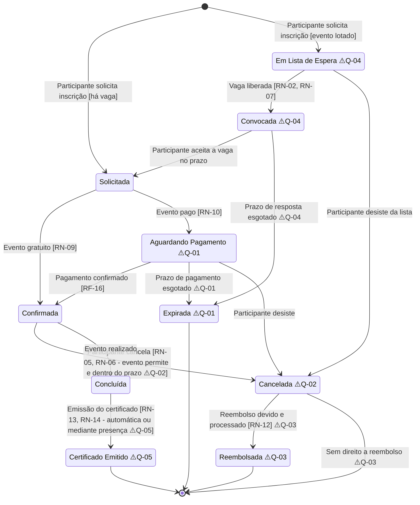

# Diagrama de Estados — Inscrição

**Documentos relacionados:** [requisitos-funcionais.md](../analise/requisitos-funcionais.md) · [regras-de-negocio.md](../analise/regras-de-negocio.md) · [duvidas-e-lacunas.md](../analise/duvidas-e-lacunas.md)
**Versão:** 1.0
**Status:** Proposta para validação com stakeholders

## Objetivo

Modelar o ciclo de vida da entidade **Inscrição**, do pedido do participante até a emissão do certificado. As transições marcadas com ⚠️ dependem das questões em aberto (Q-01 a Q-07 do documento de dúvidas e lacunas) — este diagrama foi desenhado para ser **apresentado nas reuniões de esclarecimento**: cada pendência está localizada exatamente na transição que ela define.

> **Premissas de modelagem (a validar):** assumiu-se (1) que existe reserva temporária de vaga durante o pagamento, com expiração — hipótese mais comum, dependente de Q-01; (2) que a lista de espera convoca por ordem de chegada com prazo de resposta — dependente de Q-04. Se as respostas forem outras, o diagrama será revisado.

## Diagrama

## Estados

| Estado | Descrição | Ocupa vaga? |
| --- | --- | --- |
| **Solicitada** | Pedido de inscrição registrado; ponto de decisão entre evento gratuito e pago. Estado transitório. | Sim (transitório) |
| **Aguardando Pagamento** | Evento pago; inscrição aguarda confirmação do pagamento pela Equipe Financeira (RN-10). | ⚠️ **Q-01 — a decisão central**: se ocupa, precisa de expiração; se não ocupa, pode haver mais pagamentos em curso que vagas |
| **Confirmada** | Inscrição efetivada; comprovante enviado (RN-08, RF-11). | Sim |
| **Em Lista de Espera** | Evento lotado no momento da solicitação (RN-02). | Não |
| **Convocada** | Vaga surgiu e o participante da lista foi notificado (RF-14, RF-22); aguarda aceite. | ⚠️ Q-04 — sugere-se bloquear a vaga durante o prazo de resposta |
| **Expirada** | Pagamento não confirmado no prazo, ou convocação sem resposta. Estado final; vaga liberada. | Não |
| **Cancelada** | Cancelamento pelo participante (RN-05/RN-06) ou desistência. Estado final se não houver reembolso. Vaga liberada (RN-07). | Não |
| **Reembolsada** | Cancelamento com direito a reembolso, já processado pela Equipe Financeira (RF-17). Estado final. | Não |
| **Concluída** | Evento realizado com inscrição ativa. | — |
| **Certificado Emitido** | Certificado disponível/emitido para o participante (RF-18). Estado final. | — |

## Transições com pendência (pauta de validação)

| Transição | Pendência | Questão |
| --- | --- | --- |
| `Solicitada → Aguardando Pagamento` | A vaga fica reservada nesse momento? | 🔴 Q-01 |
| `Aguardando Pagamento → Expirada` | Existe prazo de expiração? Qual? | 🔴 Q-01 |
| `Confirmada → Cancelada` | Até quando o cancelamento é permitido? Prazo por evento? | 🔴 Q-02 |
| `Cancelada → Reembolsada` vs. `Cancelada → fim` | Quais condições dão direito a reembolso? Parcial ou integral? | 🔴 Q-03 |
| `EmListaDeEspera → Convocada` | Ordem de convocação; a vaga fica bloqueada para o convocado? | 🟡 Q-04 |
| `Convocada → Expirada` | Prazo de resposta do convocado | 🟡 Q-04 |
| `Concluída → Certificado Emitido` | Automática ou condicionada à presença (exigiria estado/registro de presença — RF-19)? | 🟡 Q-05 |

## Invariantes do modelo

1. **RN-01 (limite de vagas):** a soma das inscrições em estados que ocupam vaga (`Confirmada` + os transitórios que a decisão de Q-01 incluir) nunca excede o total de vagas — sob concorrência (RNF-10).
2. **RN-07 (liberação):** toda transição para `Cancelada` ou `Expirada` a partir de estado que ocupa vaga dispara a liberação da vaga e a avaliação da lista de espera (`EmListaDeEspera → Convocada`).
3. **Notificações (RF-22):** as transições `→ Confirmada`, `→ Convocada`, `→ Cancelada`, `→ Reembolsada` e `→ Certificado Emitido` geram notificação ao participante (canais pendentes — Q-06).
4. **Escopo da inscrição:** o diagrama pressupõe inscrição por **evento**; se houver inscrição por **atividade** (RF-10), o mesmo ciclo se aplica a cada atividade — a definição pertence ao modelo conceitual de dados (e Q-07 decide o guard de conflito de horário na transição inicial).

## Cenários não cobertos (decisões futuras)

- **Cancelamento pelo organizador** (evento cancelado/adiado): não citado nas entrevistas; se existir, exige transição `Confirmada → Cancelada pelo Organizador` com política própria de reembolso. Levar à reunião com Organizadores.
- **Reembolso parcial:** se Q-03 admitir percentuais, `Reembolsada` pode exigir qualificação (integral/parcial).
- **Presença:** se Q-05 exigir presença, surge um estado intermediário (ex.: `Presença Confirmada`) entre `Concluída` e `Certificado Emitido`.
