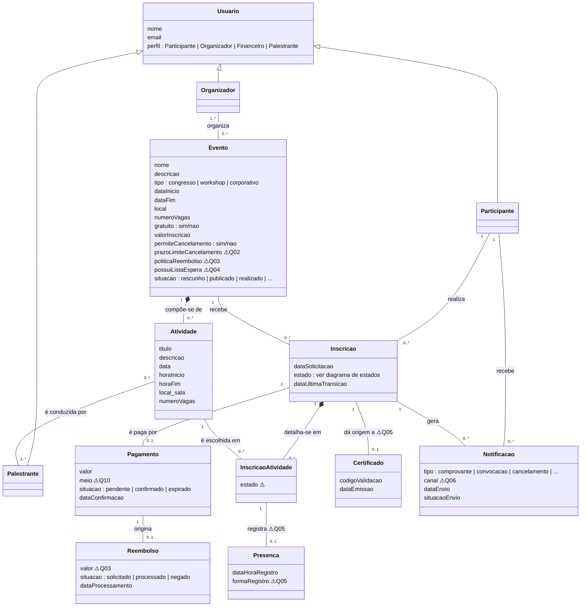

# Modelo Conceitual de Dados — Sistema de Gestão de Eventos

**Documentos relacionados:** [glossario.md](glossario.md) · [regras-de-negocio.md](../analise/regras-de-negocio.md) · [diagrama-estados-inscricao.md](diagrama-estados-inscricao.md) · [duvidas-e-lacunas.md](../analise/duvidas-e-lacunas.md)
**Versão:** 1.0
**Status:** Proposta para validação com stakeholders

## Objetivo

Representar as entidades do domínio, seus atributos essenciais e relacionamentos, no nível **conceitual** (independente de tecnologia ou banco de dados). Os nomes seguem o [glossário](glossario.md). Elementos marcados com ⚠️ dependem de questões em aberto (Q-XX) e as **decisões de modelagem** tomadas na ausência de resposta estão listadas ao final, para validação.

## Diagrama

## Entidades

| Entidade | Descrição | Regras/Requisitos |
| --- | --- | --- |
| **Usuario** | Pessoa autenticável no sistema, com perfil que determina o acesso (RN-16, RNF-01). A Equipe Financeira é um perfil de usuário interno, sem entidade própria no domínio. | RF-23 |
| **Evento** | Ocasião organizada pela Eventus, com capacidade, condição de gratuidade e **políticas próprias** (cancelamento, reembolso, lista de espera) — as políticas são atributos do Evento porque as entrevistas indicam variação por evento (RN-06, RN-09, RN-12). | RF-01, RF-03 |
| **Atividade** | Unidade da programação do Evento, com horário e vagas próprios; pode ser simultânea a outras (RN-03). | RF-02 |
| **Inscricao** | Vínculo Participante × Evento, com o ciclo de vida do [diagrama de estados](diagrama-estados-inscricao.md). A **lista de espera é modelada como estado** da Inscrição (não como entidade), com ordem dada por `dataSolicitacao`. | RF-09, RF-12, RF-13 |
| **InscricaoAtividade** | Escolha de Atividades dentro de uma Inscrição (RF-10). Permite ao Palestrante consultar os inscritos **de suas atividades** (RN-15) e, se Q-05 exigir, registrar Presença por atividade. ⚠️ Se terá estado próprio (ex.: atividade lotada com evento aberto) depende de Q-07 e da política de vagas por atividade. | RF-10, RF-21 |
| **Pagamento** | Valor devido por uma Inscrição em Evento pago; a confirmação efetiva a Inscrição (RN-10). Modelado como 0..1 por Inscrição — ⚠️ se houver novas tentativas após expiração (Q-01), passa a 0..*. | RF-15, RF-16 |
| **Reembolso** | Devolução vinculada a um Pagamento confirmado, conforme TD-03 (RN-12). | RF-17 |
| **Certificado** | Documento com código de validação (RNF-04), vinculado à Inscrição. ⚠️ Se Q-05 definir certificado **por atividade**, o vínculo migra para InscricaoAtividade. | RF-18 |
| **Presenca** | Registro de comparecimento. **Entidade condicional** — só existe se Q-05 condicionar o certificado à presença (RF-19). | RF-19 |
| **Notificacao** | Comunicação enviada ao Participante (comprovante, convocação etc.), com registro de resultado do envio (RNF-20). | RF-11, RF-22 |

## Decisões de modelagem tomadas (a validar com stakeholders)

1. **Inscrição por Evento + detalhamento por Atividade** (`InscricaoAtividade`): as entrevistas mencionam inscrição "em eventos" e "em vários workshops"; o modelo concilia os dois níveis. **Alternativa:** inscrição diretamente por Atividade, sem vínculo com o Evento — descartada porque comprovante, pagamento e cancelamento aparentam ser por evento. Confirmar com Organizadores.
2. **Lista de espera como estado da Inscrição**, não como entidade: simplifica o modelo e herda o histórico. Se Q-04 trouxer regras complexas (prioridades, listas independentes por atividade), promover a entidade própria.
3. **Políticas (cancelamento, reembolso, lista de espera) como atributos do Evento**: decorre de "nem todos os eventos permitem cancelamento" (RN-06). Se Q-02/Q-03 revelarem políticas corporativas únicas da Eventus, os atributos saem do Evento e viram parâmetros do sistema.
4. **Vagas em dois níveis** (Evento e Atividade): as entrevistas citam lotação de evento e vagas de workshops; assumiu-se capacidade própria em cada nível. Confirmar se toda Atividade controla vagas ou apenas algumas.
5. **Equipe Financeira e Equipe de TI sem entidade de domínio**: são perfis/papéis operacionais, não conceitos do negócio.

## Pontos do modelo que aguardam Q-XX

| Elemento | Pendência | Questão |
| --- | --- | --- |
| `Evento.prazoLimiteCancelamento` | Existe? Único ou por evento? | 🔴 Q-02 |
| `Evento.politicaReembolso` | Estrutura (percentuais? prazos?) | 🔴 Q-03 |
| `Pagamento` (multiplicidade e ciclo) | Reserva de vaga e expiração | 🔴 Q-01 |
| `Evento.possuiListaEspera` | Lista universal ou opcional | 🟡 Q-04 |
| `Presenca` (existência) e vínculo do `Certificado` | Emissão automática × por presença; por evento × por atividade | 🟡 Q-05 |
| `Notificacao.canal` | E-mail, sistema, outros | 🟡 Q-06 |
| `InscricaoAtividade` (guard de conflito) | Permite horários conflitantes? | 🟡 Q-07 |
| Campos de Participante visíveis ao Palestrante | Minimização LGPD | 🟡 Q-08 |
| `Pagamento.meio` | Gateway integrado × conciliação manual | 🟢 Q-10 |
